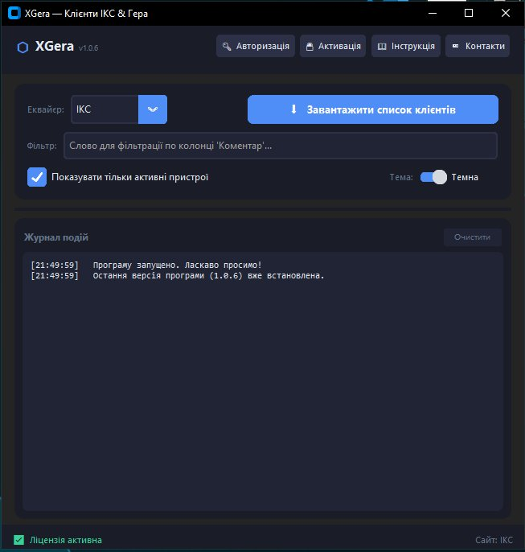
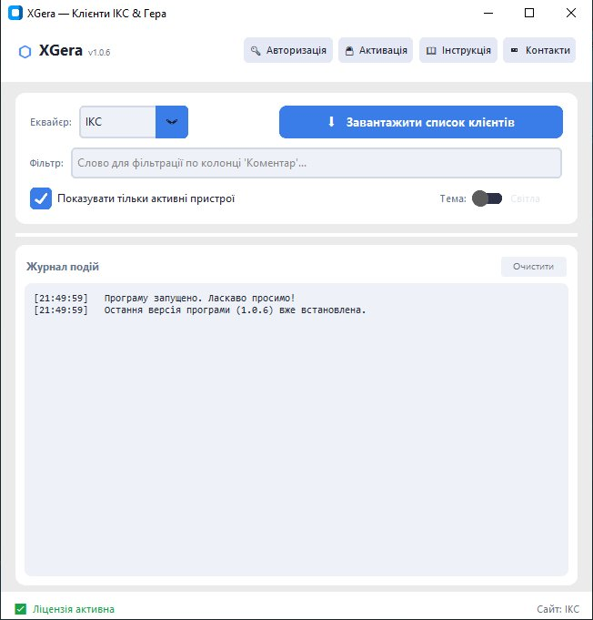
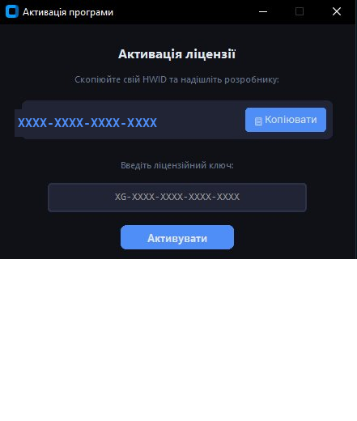

# ⬡ XGera — Клієнти ІКС & Гера

> Програма для автоматичного завантаження списку клієнтів (РРО) з сайтів еквайєрів **ІКС** та **Гера**.  
> Зберігає результат у `.xlsx` файл з фільтрацією за статусом та коментарем.

---

## 📸 Скріншоти

| Темна тема | Світла тема |
|:---:|:---:|
|  |  |

| Авторизація | Активація | Інструкція |
|:---:|:---:|:---:|
|  |  |  |

---

## ✨ Можливості

- 🔄 Автоматичне завантаження списку клієнтів з сайтів **ІКС** та **Гера**
- 📊 Збереження результату у файл **Excel (.xlsx)**
- 🔍 Фільтрація за коментарем та статусом пристрою
- 🌗 Темна та світла тема інтерфейсу
- 🔒 Дані авторизації зберігаються **локально у зашифрованому вигляді**
- 🔑 Ліцензійна активація на основі HWID
- ⬆ Автоматична перевірка оновлень через GitHub

---

## 🚀 Завантаження

👉 **[Скачати останню версію (.exe)](https://github.com/FiRmado/XGera/releases/latest)**

> Встановлення не потрібне — просто запустіть `.exe` файл.

---

## 📋 Вимоги

- **Windows** 10 / 11
- **Google Chrome** встановлений на комп'ютері
- Обліковий запис на сайті еквайєра (ІКС або Гера)

---

## 🛠 Як користуватись

1. **Авторизація** — меню `Авторизація` → введіть дані як на сайті еквайєра та вкажіть шлях до `chrome.exe`
2. **Завантаження** — оберіть сайт (ІКС або Гера) → натисніть `Завантажити список клієнтів`
3. **Фільтрація** — введіть слово для фільтру по колонці `Коментар` або залиште порожнім
4. **Збереження** — вкажіть шлях для збереження файлу Excel

---

## 🔑 Активація

Програма має **14-денний пробний період**.  
Після завершення — меню `Активація` → скопіюйте свій HWID → надішліть розробнику → отримайте ліцензійний ключ.

---

## 📞 Контакти

- **Telegram:** [@FiRmado](https://t.me/FiRmado)
- **Email:** klunko1983@gmail.com

---

  Зроблено з ❤️ для спрощення роботи з РРО еквайєрами

